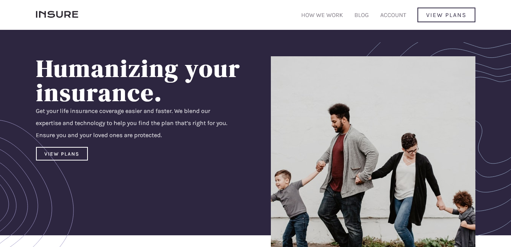

# Insure-Landing-Page
Insure Landing Page project from FrontEnd Mentor

[Frontend Mentor](https://www.frontendmentor.io) challenges allow you to improve your skills in a real-life workflow.



### Robert B. Spatz: My Thoughts

I had finished most of this project on my own, but I was not satisfied with
the result:

1. My header was not working properly in either the widescreen or the mobile
   versions, and the hero image was not above the header content in the mobile
   version, as the design called for.

2. I knew my code was anything but DRY, and I had a lot of named sections
   that could be confusing to revisit in the future.

3. The social media icons were visible in the widescreen footer, but they
   shrank and all but disappeared in the mobile footer, and I didn't know why.
   The button in the top navigation didn't line up properly with the
   navigation links.

I recently discovered Florin Pop's YouTube channel (link below), and I noticed
that he had a 2 1/2-hour live coding video demonstrating his version of this project.
I worked through the entire video, and merged parts of my solution into his
code, creating what you see here. I have many examples of how his code is
more DRY than mine was. For example, my code contained many named containers,
where Florin's code has much more simplicity.

My Code:

```html
<hr class="different-hr" />
<section class="different">
  <h2>We’re different</h2>
  <div class="different-container">
    <div class="snappy-placeholder">
      <div class="icon-placeholder">
        
      </div>
      <h4>Snappy Process</h4>

      <p>
        Our application process can be completed in minutes, not hours. Don’t
        get stuck filling in tedious forms.
      </p>
    </div>
  </div>
</section>
```

Florin's Code:

````html
<section class="container">
  <h2>We’re different</h2>
  <div class="flex">
    <div>
      
      <h3 class="space">Snappy Process</h3>
      <p class="space">
        Our application process can be completed in minutes, not hours. Don’t
        get stuck filling in tedious forms.
      </p>
    </div>
    ```
    Each section was given a class of 'container' and a class of 'flex.' In the
    stylesheet, all that had to be done was to assign 'display: flex' to the
    'flex' class for the widescreen version, and 'flex-direction: column' for
    the mobile version, and the basic design would pop into place.
    
    ### What I learned
    
    I am learning more about Flexbox, such as 'align-items: center;' which I used
    to properly align the top navigation button with the links. I have since used
    this to align icons and other elements on other FrontEnd Mentor projects that
    I had been having problems with.
    
    ### Continued Development
    Thanks again to Florin Pop, I have learned how to create a simple mobile
    navigation using JavaScript, which I am applying to several
    FrontEnd Mentor projects. I am going to practice this technique until it
    becomes effortless, and I would like to memorize the code so I can just type
    it out without having to use any references. I have created a carousel using
    JS in the past, but I need to relearn this technique so I can use it on
    projects such as the Arch Studio project I am currently building. I am
    working through a couple of courses on Udemy to learn JavaScript, and I
    want to continue using what I learn on all my projects. I am currently
    learning about string-template-literals and functions.
    
    ### Useful resources
    1. Code along with Florin Pop: Insure Landing Page
    (https://www.youtube.com/watch?v=9HVKR_hK0nY&t=7659s)
    I highly recommend this video for anyone who struggles with any part of this project, or for
    anyone who wants to improve their code. Florin's entire YouTube channel is
    an excellent resource of inspiration and knowledge.
    
    2. Darian Sampare
    https://bit.ly/2Wy0QuR
    Darian is a freelance web developer. I discovered this channel a couple of days ago, and I have found it to be an invaluable resource.
    One interesting service he provides is to review Front-End and Full-Stack Developer resumes and portfolio websites on his channel. His insights are invaluable. Two examples are:

    1. "Software Developer Portfolio Reviews | One of the most creative developer portfolios I’ve ever seen"
    https://bit.ly/3kEEfoS

    2. "How I learn any new programming language in a week | Learn Programming Fast"
    https://bit.ly/3yy8WkD
    
 
    [Robert B. Spatz Portfolio](https://rspatz.github.io/RBSpatz-Portfolio/)
    Frontend Mentor -
    [@rspatz](https://www.frontendmentor.io/profile/rspatz) -
    Twitter - [@RBSpatzDesign](https://twitter.com/RBSpatzDesign)
